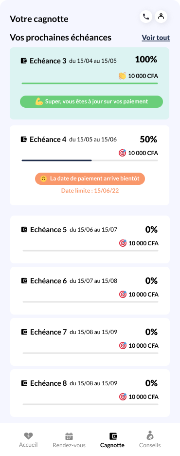

# Test technique Susu

Bienvenue !

Si tu lis ce README, c'est que tu as postulé chez Susu. Félicitations ! Tu es une personne de bon goût 😊

Ce dépôt contient notre test technique. Merci de lire attentivement ce README et de suivre les instructions ci-dessous.

## Instructions

Le but de ce test est de développer une nouvelle fonctionnalité sur un back-end fictif mais qui ressemble à ce qu'on peut faire au quotidien,
tant en terme de stack technique que de fonctionnel (nous avons récemment implémenté la même fonctionnalité en prod).

Pour t'y retrouver, les sections suivantes de ce document décrivent [la structure du code](#structure-du-code), [comment le code actuel fonctionne](#contexte-métier), et [ce que tu as à implémenter](#spécifications).

Mais avant d'attaquer, prends le temps de lire les instructions à suivre :

- Clone ce repository sur ton compte Github, BitBucket ou Gitlab
- Implémente la fonctionnalité décrite ci-dessous dans une nouvelle branche
- Crée une PR **sur ton repo** (i.e. de ta branche de développement sur ta branche master) et mets-nous (laurent.leconte@susu.fr, alexandre.gbaguidiaisse@susu.fr, nathan.boeglin@susu.fr) en relecteurs de la PR
- S'il te reste du temps: tu peux identifier les endroits du code existant sur lequel tu penses qu'on peut rendre le code plus lisible, plus efficace...
  - NOTE 1 : le fichier `backend/db/in_memory_database.py` est exclu de cet exercice: cette classe a uniquement pour but de pouvoir accéder à des données de test, le code n'est pas très beau
  - NOTE 2 : il ne t'est **pas** demandé de faire une refacto du code. L'idée est d'avoir une discussion ensemble sur les améliorations qu'on pourrait apporter au code.
- J'insiste : aucun commit ni PR directement sur ce repository ! Merci 😉

## Structure du code

Ce repository contient une application FastAPI simple, avec quelques endpoints servant à démontrer l'organisation du code et la structure des données.

### `backend`

Ce répertoire contient le code de l'application à proprement parler.

Le répertoire `db` implémente une "DB in memory" (en gros un dictionnaire glorifié 😁) de façon à ce que les autres parties du code puissent avoir accès à des données.
Normalement tu n'as pas besoin de toucher à cette partie, ni de comprendre le fonctionnement de la DB.
Tu auras éventuellement besoin de l'interface qui décrit les opérations possibles avec la DB, qui se trouve dans `models/interfaces.py`.

Le répertoire `logic` contient l'implémentation de la logique métier. C'est probablement dans ce répertoire que tu ajouteras ton code.

Le répertoire `models` contient la déclaration des modèles de données et des interfaces utilisés dans le reste du code.

Le point d'entrée dans le code est la fonction `main.py`.

### `tests`

Le répertoire de tests.

### Installer et lancer le code

⚠️ Les instructions ci-dessous sont pour **Python 3.10**. Si tu utilises une version plus récente de Python, il faudra peut-être mettre à jour les dépendances si tu as des messages d'erreur.

Pour installer les dépendances:

```
poetry install
```

Pour lancer les tests:

```
poetry run pytest
```

Pour faire tourner le serveur en local:

```
poetry run uvicorn backend.main:app
```

Pour consulter la doc API (auto-générée) quand le serveur tourne : http://127.0.0.1:8000/docs

## Contexte métier

### Le mécanisme de paiement des services

Nous distribuons des services facturés mensuellement à nos utilisateurs. Certains de nos utilisateurs n'ont pas de compte en banque ou de CB permettant de mettre en place un prélèvement mensuel pour payer leur abonnement.

Dans ce cas, l'utilisateur (ou ses proches) alimentent une "cagnotte" via des versements ponctuels, dans laquelle nous piochons chaque mois pour prélever le montant de la facture mensuelle. Le code présent dans ce dépôt gère (de façon simplifiée) ce mécanisme, en manipulant des _transactions_ qui correspondent à ces mouvements entrants et sortants.

### Les transactions

L'API permet d'interagir avec la liste des transactions d'un utilisateur. Chaque transaction correspond à un mouvement entrant ou sortant dans la cagnotte de l'utilisateur, de la même façon que ton relevé de compte en banque liste les crédits et les débits qui ont eu lieu au cours du mois sur ton compte.

Il y a 3 types de transactions, décrits par l'énumération `models.TransactionType`:

- un _versement_ (`TransactionType.DEPOSIT`) correspond à un versement fait par l'utilisateur ou un tiers sur sa cagnotte. Un versement _augmente_ le solde de l'utilisateur.
- un _prélèvement programmé_ (`TransactionType.SCHEDULED_WITHDRAWAL`) correspond à une facturation pour l'utilisation du service. Un prélèvement, une fois effectué, _diminue_ le solde de l'utilisateur.
- un _remboursement_ (`TransactionType.REFUND`) correspond à un remboursement effectué vers un tiers. Un remboursement _diminue_ le solde de l'utilisateur.

Chaque transaction a un cycle de vie spécifique (décrit par l'énumération `models.TransactionState`) :

- les versements et les remboursements sont créés à l'état `PENDING` le temps que la transaction soit traitée par la passerelle de paiement. Ils passent ensuite soit à l'état `COMPLETED` si la transaction a réussi, soit à l'état `FAILED` si elle a échoué.
- les prélèvements pour toute la durée du contrat sont générés automatiquement à la création du compte utilisateur, à l'état `SCHEDULED`. Ils sont ensuite passé à l'état `COMPLETED` à l'échéance du prélèvement si le solde client est supérieur au montant du prélèvement. Si ce n'est pas le cas, ils passent à `FAILED`.

En plus d'un type et d'un état, une transaction a également les attributs suivants:

- un _montant_. Ce montant est toujours positif, même si une transaction a pour résultat de diminuer le solde.
- une _date_. Pour un versement ou un remboursement, c'est la date de dernier changement d'état (création si l'état est `PENDING`, validation du paiement si l'état est `COMPLETED`, rejet du paiement si l'état est `FAILED`). Pour un versement programmé, c'est la date de prélèvement prévue (si le prélèvement est dans le futur ou si le paiement a échoué) ou effective (si le prélèvement a eu lieu). NOTE : pour les besoins de ce test, tu n'as pas besoin de rentrer dans la logique de gestion des dates.

## Spécifications

### Fonctionnalité à développer

L'objectif est d'implémenter l'endpoint `/users/{user_id}/transactions/balance`, qui calcule l'état de financement d'un utilisateur, c'est-à-dire dans quelle mesure le solde actuel de l'utilisateur couvre la liste des prélèvements à venir.

En appelant cet endpoint, on obtient en réponse :

- la liste des prélèvements programmés futurs (i.e. `SCHEDULED`) d'un utilisateur avec, pour chaque prélèvement:
  - le montant du prélèvement
  - le montant couvert par le solde actuel
  - le taux (en pourcent, entre 0 et 100) de couverture du montant
- le solde de la cagnotte une fois tous les prélèvements futurs couverts, ou 0 si le solde actuel ne permet pas de couvrir tous les prélèvements à venir.

Pour illustrer le résultat attendu, cet endpoint est appelé par l'application mobile pour afficher la page suivante :



### Règles de calcul

Pour calculer le solde d'une cagnotte :

- on additionne tous les versements à l'état `COMPLETED`
- on soustrait les prélèvements à l'état `COMPLETED`
- on soustrait les remboursements à l'état `COMPLETED` **ou** `PENDING`

Pour calculer l'état de financement du service d'un utilisateur donné :

- on calcule le solde de la cagnotte de l'utilisateur (cf ci-dessus)
- ensuite on retranche de ce solde le montant de chaque prélèvement programmé, du plus proche au plus lointain
- on continue tant que le solde est positif ou tant qu'il reste des prélèvements futurs. Si le solde restant ne permet pas de couvrir l'intégralité d'un prélèvement, on calcule le pourcentage de couverture de la façon suivante: (montant du prélèvement - solde) / montant du prélèvement, arrondi à l'entier le plus proche.

### Exemples

Pour les transactions suivantes :

| type                 | état      | montant | date       |
| -------------------- | --------- | ------- | ---------- |
| deposit              | COMPLETED | 20      | 2020-01-01 |
| deposit              | FAILED    | 10      | 2020-01-02 |
| deposit              | COMPLETED | 30      | 2020-01-05 |
| scheduled_withdrawal | COMPLETED | 20      | 2020-01-15 |
| deposit              | COMPLETED | 15      | 2020-01-16 |
| deposit              | COMPLETED | 10      | 2020-01-17 |
| refund               | COMPLETED | 10      | 2020-01-17 |
| deposit              | PENDING   | 15      | 2020-01-28 |
| scheduled_withdrawal | SCHEDULED | 20      | 2020-02-15 |
| scheduled_withdrawal | SCHEDULED | 20      | 2020-03-15 |
| scheduled_withdrawal | SCHEDULED | 20      | 2020-04-15 |
| scheduled_withdrawal | SCHEDULED | 20      | 2020-05-15 |

- le solde de la cagnotte est 20 + 30 - 20 + 15 + 10 - 10 = 45
- ce solde est suffisant pour couvrir entièrement les **2** prochains prélèvements; pour ces prélèvements on renverra donc
  - montant : 20
  - montant couvert : 20
  - taux de couverture : 100
- le solde couvre partiellement le 3ème prélèvement programmé. Pour ce prélèvement on renverra
  - montant : 20
  - montant couvert : 5
  - taux de couverture : 25
- le dernier prélèvement programmé n'est pas couvert, on renverra donc
  - montant : 20
  - montant couvert : 0
  - taux de couverture : 0
- le solde une fois tous les prélèvements traités est 0

Dans ce deuxième exemple :

| type                 | état      | montant | date       |
| -------------------- | --------- | ------- | ---------- |
| deposit              | COMPLETED | 40      | 2020-01-01 |
| refund               | PENDING   | 10      | 2020-01-15 |
| scheduled_withdrawal | SCHEDULED | 20      | 2020-01-15 |

- le solde est 40 - 10 = 30
- le prélèvement programmé est entièrement couvert
- il reste un solde de 10

### Autres considérations

- Ta PR écrit devra contenir des tests couvrant les différents scénarios possibles
- Le code doit passer les tests décrits dans le fichier de CI/CD (`.circleci/config.yml`), à savoir :
  - le code est correctement formaté : `poetry run black --check backend/` ne renvoie pas d'erreur. Pour formater le code, la commande à utiliser est `poetry run black <répertoire>`
  - le code est conforme à notre politique de linting : `poetry run pylint backend/` ne renvoie pas d'erreur. La meilleure façon de gérer les erreurs de linting (corriger le code, exclure une ligne explicitement, exclure une catégorie d'erreur en mettant à jour le fichier `.pylintrc`) est laissée à ton appréciation.
  - les tests passent.
